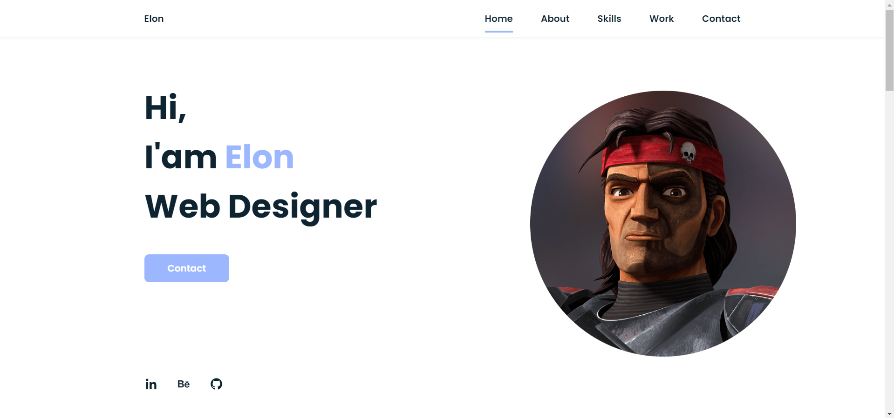
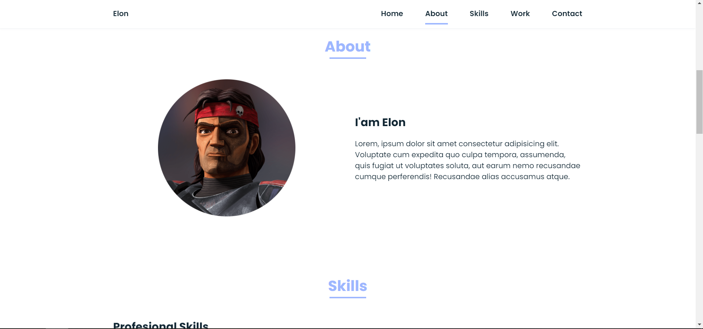
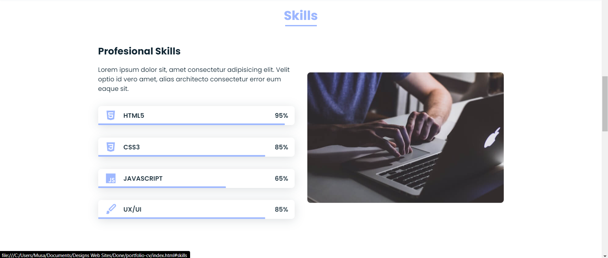
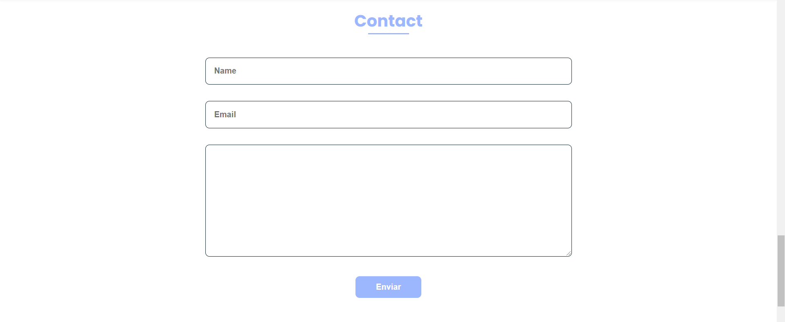

# Portfolio CV Website

A complete multi-section portfolio and resume website with ScrollReveal animations, skill progress bars, and a contact form.

## ✨ Features

- Smooth scroll navigation with active link highlighting
- ScrollReveal-powered entrance animations for all sections
- Animated skill progress bars with percentage labels
- Project/work gallery with hover zoom effect
- Contact form with styled inputs
- Responsive mobile-first layout with hamburger menu

## 🛠 Technologies

- HTML5
- SCSS (BEM nesting, grid, custom properties)
- JavaScript (menu toggle, active links, form handling)
- ScrollReveal JS
- Boxicons

## 🚀 Usage

Open `index.html` in your browser. Scroll through the sections to see reveal animations.